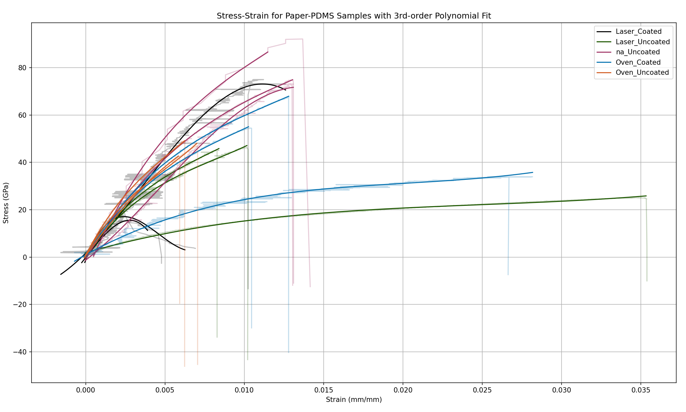

# to address
 - make sure the linear region is consistently found in the FindLinearRegion function
 - alternate colors for each sample group with a standard colors array
 - import real thicknesses from csvs
 - more properties:
  - yield strength from end of linear region
  - ultimate strength
  - toughness
  - strain at break

other folder: "D:\TestFrameData"

# properties to check
 - stiff (stiffness/ elastic modulus)
 - strong (yield and ultimate strength)
 - ductile (ductility/brittleness how much deformation causes break - why no necking despite ductility)
 - tough (energy absorbed before breaking)
 - hard
 - maximum elongation
 - ductility

# special handling for new main
 - name ends with thickness in mm 
 - beginning 6 characters of same sample groups are the same (change triggers color change)

# stackoverflow linear region post
-find linear region with second derivative.  fast and simple method->
    "convolve the data with a conolution kernel equal to 
    second derivative of a gaussian.  The adjustable part is the width of the kernel"

# pandas productivity tutorial
-assigning worksheet data to dataframes
-printing dataframes, columns from dataframes
-concatinating data from multiple spreadsheets and printing
-groupby function to select data by column header and .mean for average
-loc function to select multiple rows of data 
-plot function (kind='bar') and plt.show function to plot and show data
-to_excel function with new data

# pandas data science tutorial
-specify tab delimiting (df = pd.read_csv('file.txt', delimieter='\t')
-read columns by column name print(df.columns) and selecting on some with print(df['Name'][0:5])
-read rows by row number print(df.iloc[1:4])
-math data with df.describe()
sorting with df.sort_values()

# additonal to-do
fix broken shakiness in graphs
implement 'region of linearity', 'convolution kernel' material
make separate plot with youngs moduli and maybe other extractable data (e.g., sternght)

find csv(s)
X read csv into dataframe (need cross section, stress, and strain)
X extract cross section from line 3 (test run name)
X construct stress data from force/(width*thickness)
X lot stress vs strain 
X find region of linearity
X extract young's modulus (slope) of trendline from that region
extract ultimate tensile  from last point before threshold drop (90%?)
construct formatted veusz plot with original data, trendline, and cutoffs (want values shown on graph and consistent dimensions)
add young's modulus to list of moduli
make interface on psu website for returning values, graphs, and csvs for drag-and-dropping 50kN files